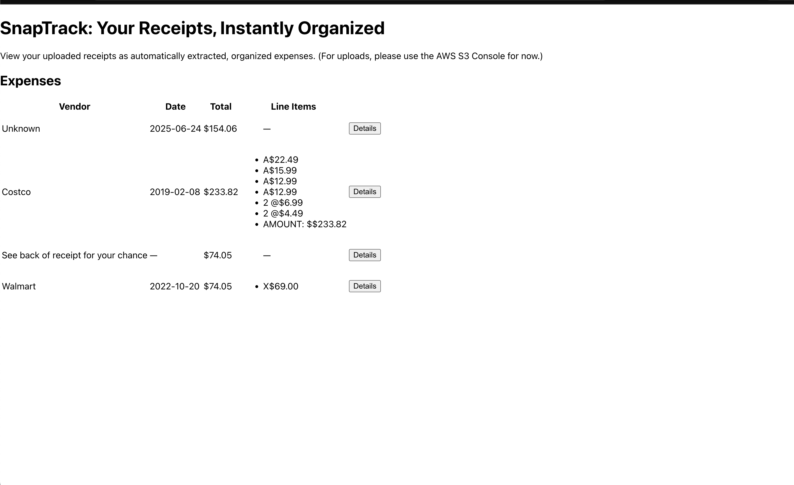

SnapTrack: Your Receipts, Instantly Organized
No more manual data entry. Just snap, upload, and relax—SnapTrack does the rest.

# Overview
SnapTrack is a fully serverless expense tracker that automates receipt entry for small businesses, freelancers, and anyone tired of paperwork. Upload a receipt image—SnapTrack extracts all the important info and presents it in a modern dashboard, ready for your books or tax reports.

# Features
Instant Receipt Processing: Upload a receipt, and details (vendor, date, total, line items) are extracted automatically.

Modern, Animated Dashboard: View all expenses in a sleek React/Tailwind interface.

Serverless & Scalable: Built entirely on AWS—no server management required.

Secure Cloud Storage: Receipts and data are stored safely in S3 and DynamoDB.

Automated Reports: Optionally, get monthly summary emails with all your expenses.

Ready for Real Business: Handles multiple receipt formats, fast and accurate.

# Architecture Diagram

User → S3 (upload) → Lambda → Textract → DynamoDB → API Gateway → React Frontend (Amplify)

# Tech Stack
Service/Tool	Purpose
AWS Lambda	Serverless compute for OCR/data extraction
Amazon S3	Stores uploaded receipt images
AWS Textract	OCR and structured data extraction from images
DynamoDB	Secure, fast NoSQL storage for expense records
API Gateway	REST API endpoints for frontend-backend comms
Amazon SES	(Optional) Sends automated email reports
React.js	Frontend framework for interactive dashboard
Tailwind CSS	Styling and responsive design
AWS Amplify	Hosting and CI/CD for frontend
Python	Main backend logic and regex post-processing
Boto3	AWS SDK for Lambda integrations

# How to Deploy
Clone the repository

Set up AWS resources (S3, DynamoDB, Lambda, API Gateway, SES)

Add environment variables to your Lambda functions (e.g., table name)

Connect S3 triggers to Lambda for automatic processing

Deploy the frontend with AWS Amplify (connect GitHub and deploy branch)

Test: Upload a receipt and watch it appear on the dashboard!

# Why SnapTrack?
SnapTrack saves hours every month and avoids manual errors. It’s simple, scalable, and works for anyone—from small businesses to individuals. No more lost receipts. No more headaches.

---- Shivam Singh ----
